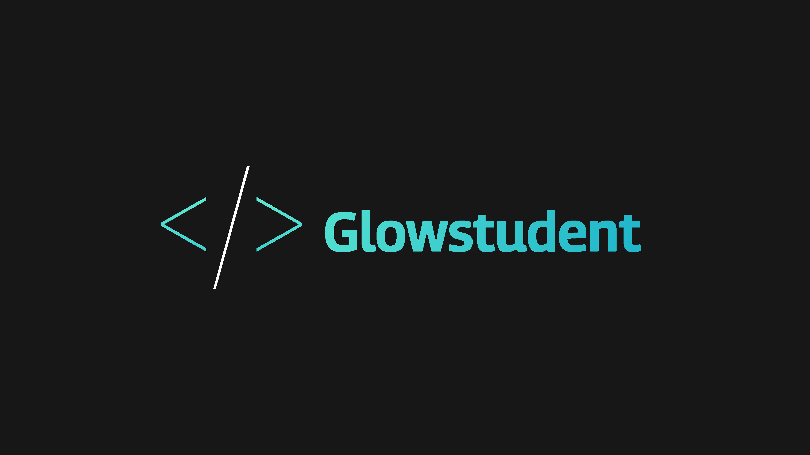

<h1 align="center">Interests</h1>

- Coding
- Games
- Animating
- Rendering

<h1 align="center">About Me</h1>
I enjoy coding websites seeing how different elements interact and how everything falls together perfectly. I had started coding Minecraft Spigot Plugins awhile ago and have just recently reentered into the realm of creating these Plugins, But enough about that for now.

<h1 align="center">Stats</h1>

 

<h1 align="center">Programs</h1>

<h1 align="Center">Connect with me:</h1>

 

<h1 align="Center">Support me</h1>

