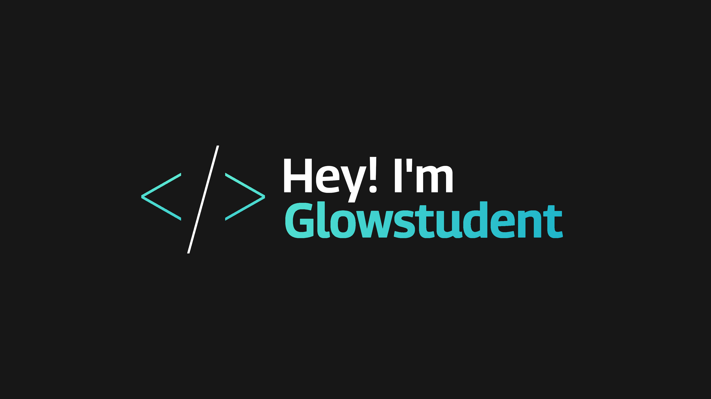

<!---  --->

  
 

<h1 align="center">About Me</h1>

  
I'm a learning website coder, decent Discord bot developer and not very good Minecraft plugin creator.

<h1 align="center">Stats</h1>

 

<h1 align="center">Software</h1>

 

  

<h1 align="Center">Joke</h1>

<h1 align="Center">Activity</h1>

  

<h1 align="Center">Connect with me</h1>

